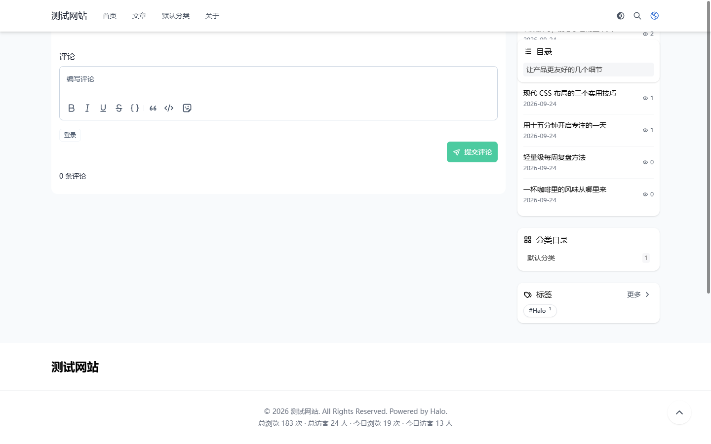
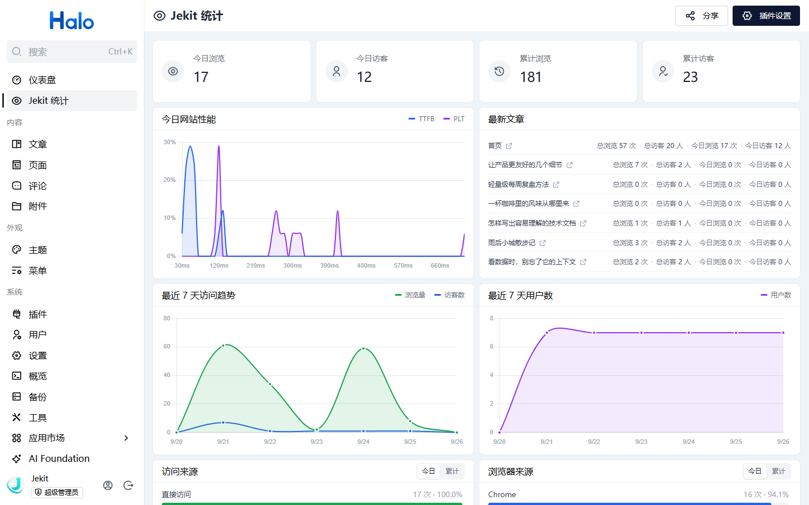
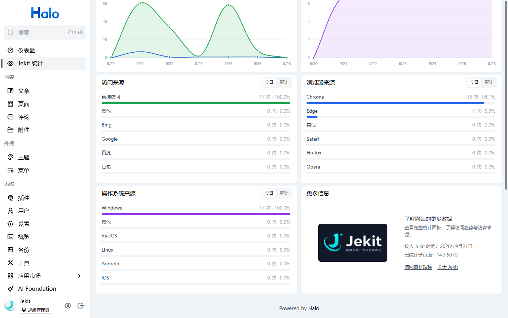
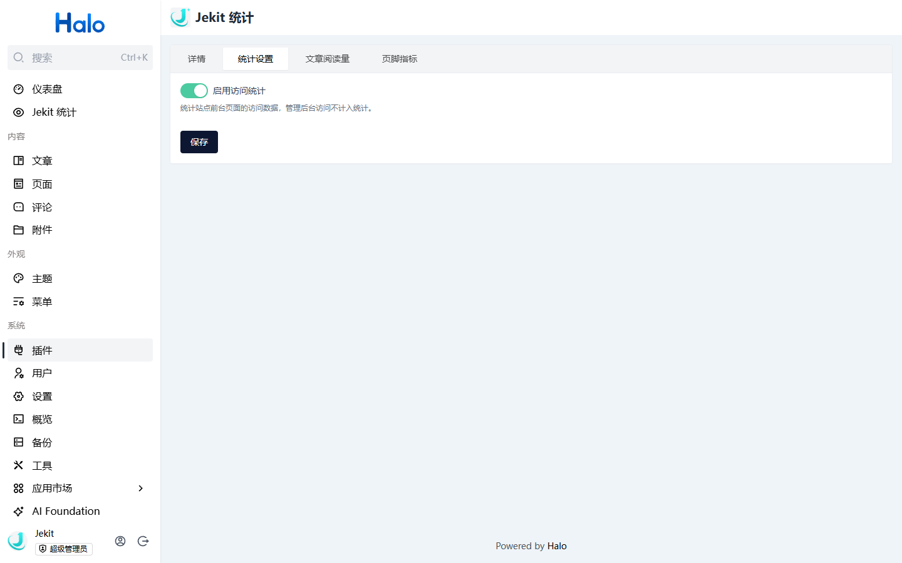
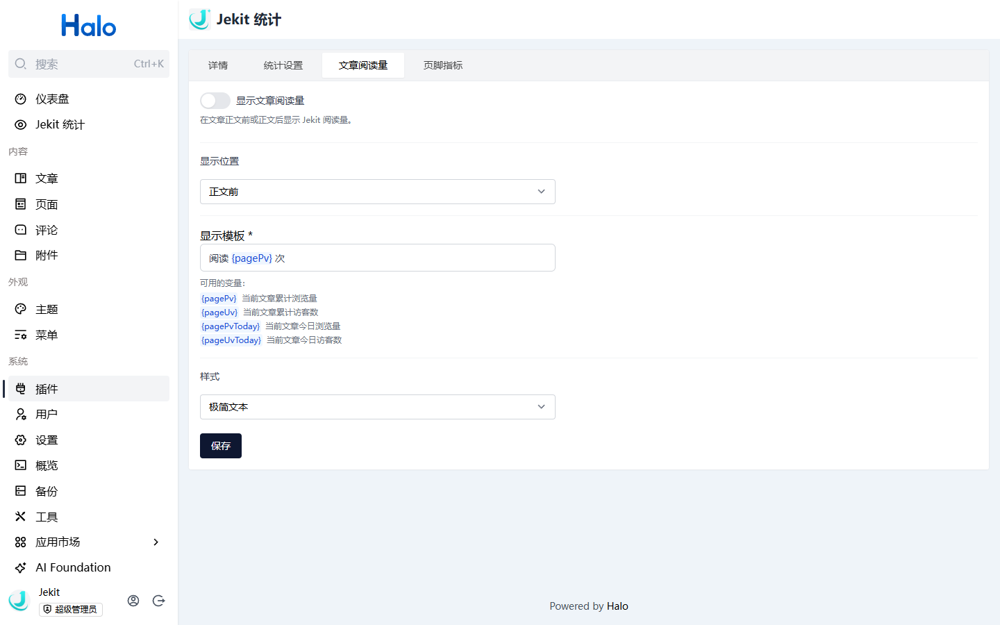
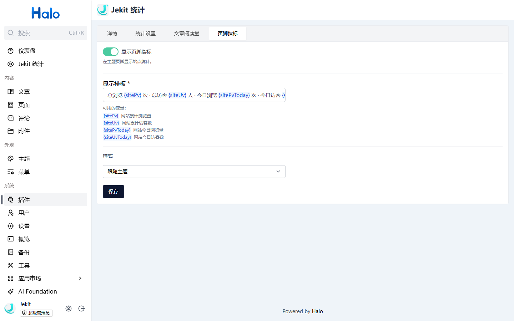

# Jekit 统计

安装即用，无需自建统计服务。为 Halo 提供访问趋势、来源分析与网站性能指标，并支持文章阅读量和页脚统计。插件使用 Jekit 公共服务器保存统计数据，**站点统计公开可查询**；启用前请阅读下方的[数据说明](#数据存储与公开查询)。

适用版本：Halo 2.26.0 及以上。

## 特性

- **站点概览**：查看今日与累计浏览量、访客数，以及最近 7 天的访问趋势和用户数。
- **来源分析**：分别查看访问来源、浏览器和操作系统；来源卡片支持独立切换“今日 / 累计”。
- **网站性能**：查看今日 TTFB、PLT 的分布图，并在 Halo 仪表盘小组件中快速查看关键数值。
- **文章数据**：展示首页和最新文章的浏览量、访客数；可选择在文章正文前或正文后显示阅读量。
- **页脚指标**：按需在主题页脚显示站点统计，支持变量模板和三种样式预设。
- **轻量接入**：启用插件即可统计站点前台访问；管理后台访问不计入统计。无需另行部署统计服务或数据库。

## 界面预览

以下画面截自实际运行的 Halo 测试站点。截图中的文章与统计数字仅供展示，会随站点访问变化。

## 安装与启用

在本页面点击 **安装**，然后到 Halo Console 的插件列表**启用**“Jekit 统计”。启用后，点击左侧导航中的 **Jekit 统计**即可打开面板。

如果刚安装时没有数据，先访问一次网站前台，再返回统计面板查看。统计站点需要能够连接 Jekit 服务。

## 设置能力

在 **插件 → Jekit 统计** 的详情页中可以找到以下设置。修改后点击对应页签的 **保存**。

### 统计设置

“启用访问统计”默认开启。关闭后不再通过本插件统计新的前台访问；Halo Console 本身的访问不计入统计。

### 文章阅读量

“显示文章阅读量”默认关闭。开启后可选择显示在正文前或正文后，编辑显示模板，并选择“跟随主题 / 极简文本 / 徽章”样式。模板支持当前文章的累计和今日浏览量、访客数变量；输入变量时可获得高亮与补全。阅读量显示在正文附近，若希望放进主题标题元信息区域，需要主题另行适配。

### 页脚指标

“显示页脚指标”默认开启。可以编辑站点统计模板，并选择“跟随主题 / 极简文本 / 徽章”样式。模板支持站点累计和今日的浏览量、访客数变量，同样提供变量高亮与补全。主题需要保留 `<halo:footer />`，页脚内容才能显示。

## 数据存储与公开查询

- 本插件使用 **Jekit 公共统计服务**。访问数据按站点域名汇总，保存在 Jekit 服务器，而非你的 Halo 服务器。
- **统计结果不是私有数据**。任何人都可以在 [Jekit 官网统计面板](https://jekit.cn/stats/)输入你的站点域名查询已公开的统计指标，也可以通过带域名的链接分享，例如 `https://jekit.cn/stats/?query=https://jekit.cn`。请勿将需要保密的站点统计接入本服务。
- Jekit 当前的统计设计使用页面标识与分类后的来源、设备等数据，不主动上报完整页面路径、查询参数、页面标题、Cookie 或完整 Referrer。具体设计与限制请阅读 [Jekit 的隐私与实现说明](https://jekit.cn/docs/faq/impl/)；[Jekit 是什么](https://jekit.cn/docs/intro/what-this-is/)介绍了公共服务的定位。
- 停用或卸载 Halo 插件只会停止本插件继续提供功能，**不等于删除已经保存在 Jekit 服务器上的历史统计数据**。
- **安装并使用本插件，即表示你已知晓并接受上述数据存储与公开查询方式。**

如有问题或建议，请到 [GitHub Issues](https://github.com/heyManNice/jekit-sdk/issues)反馈。
